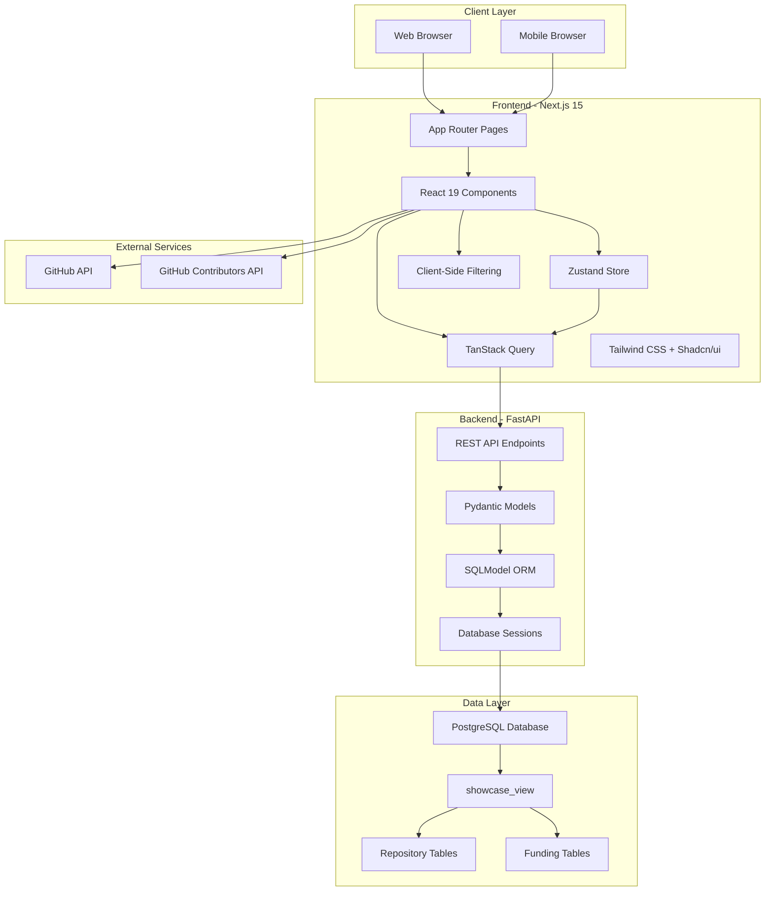
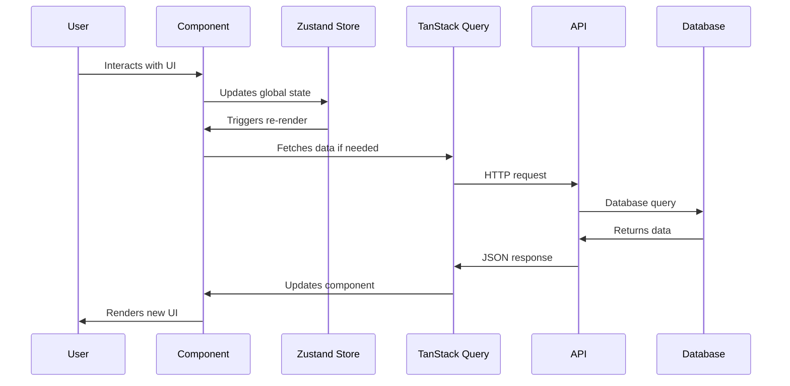
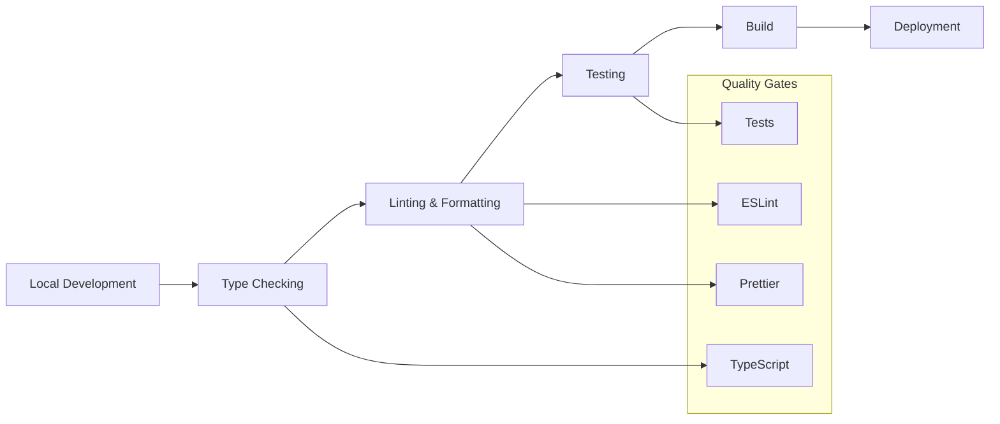

# Architecture Overview

UC ORB Showcase follows a modern full-stack architecture with clear separation of concerns, type safety, and performance optimization. This document provides a comprehensive overview of the system design and technical decisions.

## System Architecture



## Frontend Architecture

### Next.js 15 with App Router

The frontend uses Next.js 15 with the new App Router for modern React development:

```
frontend/
├── app/                          # Next.js App Router
│   ├── layout.tsx               # Root layout with providers
│   ├── page.tsx                 # Home page
│   ├── repositories/            # Repository browsing
│   │   ├── page.tsx            # Repository list page
│   │   ├── RepositoriesPageClient.tsx  # Client component
│   │   └── [owner]/[repo]/     # Dynamic repository detail
│   │       ├── page.tsx        # Repository detail page
│   │       └── layout.tsx      # Repository layout
│   ├── about/                   # About page
│   ├── connect/                 # Contact/submission page
│   └── Providers.tsx           # React Query provider
├── components/                   # Reusable components
├── store/                       # Zustand state management
├── lib/                         # Utility functions
└── styles/                      # Global styles
```

### Component Architecture

The frontend follows a component-based architecture with clear separation of concerns:

#### Page Components
- **Server Components**: Handle initial data loading and SEO
- **Client Components**: Manage interactivity and state
- **Layout Components**: Provide consistent page structure

#### UI Components
- **Atomic Design**: Small, reusable components
- **Composition**: Complex components built from simpler ones
- **Props Interface**: Type-safe component APIs

#### State Management
- **Zustand**: Global state for filters and repositories
- **TanStack Query**: Server state and caching
- **Local State**: Component-specific state with useState

### Data Flow Pattern



## Backend Architecture

### FastAPI Service Design

The backend is built with FastAPI following REST principles and clean architecture:

```
backend/
├── main.py                      # FastAPI application and routes
├── models.py                    # SQLModel and Pydantic models
├── database.py                  # Database connection and session
├── keys.py                      # Environment configuration
└── requirements.txt             # Python dependencies
```

### API Design Principles

#### RESTful Endpoints
- **Resource-based URLs**: `/repositories`, `/universities`, `/languages`
- **HTTP Methods**: GET for data retrieval (read-only API)
- **Status Codes**: Proper HTTP status codes for responses
- **Content Type**: JSON for all responses

#### Data Models
```python
# SQLModel for database operations
class Repository(SQLModel, table=True):
    __tablename__ = "showcase_view"
    full_name: str = Field(primary_key=True)
    description: str | None
    university: str | None
    # ... other fields

# Pydantic for API responses
class RepositoryResponse(BaseModel):
    full_name: str
    description: str | None
    university: str | None
    # ... other fields
```

### Database Integration

#### PostgreSQL with SQLModel
- **ORM**: SQLModel for type-safe database operations
- **Migrations**: Database schema managed externally
- **Views**: `showcase_view` aggregates data from multiple tables
- **Indexing**: Optimized for filtering and search operations

#### Query Optimization
```python
# Efficient filtering with database-level operations
statement = select(Repository).where(Repository.approved == True)

# Dynamic filtering based on request parameters
if university:
    statement = statement.where(Repository.university.in_(university))
if language:
    statement = statement.where(Repository.language.in_(language))

# Sorting with proper indexing
statement = statement.order_by(Repository.stargazers_count.desc())
```

## Data Architecture

### Database Schema

The application uses a view-based approach for clean API interfaces:

```sql
-- Main view that aggregates repository data
CREATE VIEW showcase_view AS
SELECT 
    full_name,
    description,
    short_description,
    university,
    license,
    owner,
    organization,
    language,
    stargazers_count,
    html_url,
    forks_count,
    subscribers_count,
    created_at,
    readme,
    homepage,
    default_branch,
    approved,
    topic_area_ai,
    -- Contact information
    contact_name,
    contact_email,
    contact_name2,
    contact_email2,
    contact_name3,
    contact_email3,
    -- Funding information
    funder1,
    grant_number1_1,
    grant_number1_2,
    grant_number1_3,
    funder2,
    grant_number2_1,
    grant_number2_2,
    grant_number2_3
FROM repositories r
LEFT JOIN repository_funding rf ON r.id = rf.repository_id
LEFT JOIN funders f1 ON rf.funder1_id = f1.id
LEFT JOIN funders f2 ON rf.funder2_id = f2.id;
```

### Data Flow

1. **Repository Data**: Sourced from GitHub API and manual curation
2. **Metadata Enhancement**: UC-specific information added manually
3. **View Aggregation**: `showcase_view` combines data from multiple tables
4. **API Exposure**: FastAPI serves filtered and sorted data
5. **Frontend Consumption**: React components display the data

## Performance Architecture

### Frontend Performance

#### Client-Side Optimization
- **Single Data Load**: All repositories fetched once and cached
- **Client-Side Filtering**: Instant results without API calls
- **Memoization**: Expensive computations cached with useMemo
- **Code Splitting**: Dynamic imports for route-based splitting

#### Caching Strategy
```typescript
// TanStack Query configuration
const queryClient = new QueryClient({
  defaultOptions: {
    queries: {
      staleTime: 300_000,  // 5 minutes
      gcTime: 600_000,     // 10 minutes
      refetchOnWindowFocus: false,
    },
  },
});
```

#### State Management Optimization
```typescript
// Zustand store with selective subscriptions
const searchTerm = useRepositoriesStore((state) => state.searchTerm);
// Component only re-renders when searchTerm changes

// Memoized filtering for performance
const filteredRepositories = useMemo(() => {
  // Expensive filtering logic
}, [repositories, filters, searchTerm]);
```

### Backend Performance

#### Database Optimization
- **Indexed Columns**: All filterable fields have database indexes
- **View-Based Queries**: Pre-aggregated data for faster access
- **Connection Pooling**: Efficient database connection management
- **Query Optimization**: Minimal database round trips

#### API Performance
```python
# Efficient filtering at database level
def list_repositories(
    university: List[str] = None,
    language: List[str] = None,
    # ... other filters
):
    statement = select(Repository).where(Repository.approved == True)
    
    # Apply filters at database level
    if university:
        statement = statement.where(Repository.university.in_(university))
    
    return session.exec(statement).all()
```

## Security Architecture

### Frontend Security
- **Type Safety**: TypeScript prevents runtime errors
- **Input Validation**: Zod schemas validate all user input
- **XSS Prevention**: React's built-in XSS protection
- **HTTPS Only**: All production traffic over HTTPS

### Backend Security
- **Input Validation**: Pydantic models validate all requests
- **SQL Injection Prevention**: SQLModel ORM prevents SQL injection
- **CORS Configuration**: Proper CORS headers for cross-origin requests
- **Rate Limiting**: API rate limiting (planned feature)

### Data Security
- **Read-Only API**: No write operations exposed publicly
- **Approved Content**: Only approved repositories shown
- **Public Data**: All displayed data is already public on GitHub

## Scalability Architecture

### Horizontal Scaling
- **Stateless Backend**: FastAPI service can be horizontally scaled
- **Database Scaling**: PostgreSQL supports read replicas
- **CDN Integration**: Static assets served via CDN
- **Microservices Ready**: Architecture supports service decomposition

### Vertical Scaling
- **Database Optimization**: Efficient queries and indexing
- **Caching Layers**: Multiple levels of caching
- **Resource Optimization**: Minimal resource usage per request

## Development Architecture

### Type Safety
- **End-to-End Types**: TypeScript from frontend to backend
- **Schema Validation**: Pydantic and Zod ensure data integrity
- **API Contracts**: OpenAPI specification for API documentation

### Development Workflow


### Deployment Architecture
- **Frontend**: Vercel for Next.js deployment
- **Backend**: Docker containers for FastAPI
- **Database**: Managed PostgreSQL service
- **Documentation**: Separate Docusaurus deployment

This architecture provides a solid foundation for a scalable, maintainable, and performant application while ensuring type safety and developer experience.