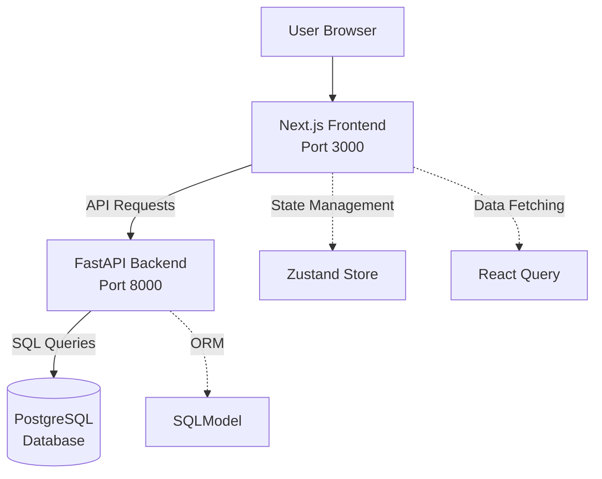

# Architecture

This document explains the UC ORB Showcase system architecture and how components interact.

## System Overview

UC ORB Showcase architecture:

## Frontend Architecture

**Location:** `/frontend/`

The frontend is a Next.js application with the App Router.

### Key Components:
- **Pages** (`app/`): Route handlers and page components
- **Components** (`components/`): Reusable UI components
- **State** (`store/`): Zustand store for client-side state
- **Styles** (`globals.css`, Tailwind): Application styling

### State Management:
Zustand store (`store/repositories.ts`) manages:
- Repository data and filters
- Search terms and selected options
- UI state for filtering

### Data Flow:
1. User interacts with UI components
2. Components read/update Zustand state
3. TanStack React Query fetches data from backend API
4. UI re-renders based on state changes

### Main Pages:
- `/` - Homepage
- `/repositories` - Repository listing
- `/about` - About page  
- `/connect` - Contact/submission page

## Backend Architecture

**Location:** `/backend/`

FastAPI application providing REST API endpoints.

### Key Files:
- **`main.py`** - FastAPI app, routes, and endpoints
- **`models.py`** - SQLModel database models
- **`database.py`** - Database connection and session management
- **`keys.py`** - Environment variable configuration

### Database Model:
Uses `showcase_view` table with repository information including name, description, university, language, and metadata.

### API Endpoints:
- `GET /repositories` - List repositories with filtering
- `GET /languages` - Get unique programming languages
- `GET /universities` - Get unique universities
- `GET /licenses` - Get unique licenses
- `GET /owners` - Get unique repository owners
- `GET /topics` - Get unique topic areas

## Database Architecture

**Technology:** PostgreSQL

### Main Table:
- **`showcase_view`** - Primary table containing repository information

### Data Source:
The database is populated from GitHub repository data and contains:
- Repository metadata (stars, forks, language)
- UC affiliation information
- Contact and funding details
- Topic area classifications

## Docker Configuration

**File:** `docker-compose.yml`

### Services:
- **backend** - FastAPI application (port 8000)
- **frontend** - Next.js application (port 3000)

### Networking:
- Uses `local-dev-net` external network
- Services communicate via service names
- Volume mounts for development

## Configuration

**Backend:** Database connection via `POSTGRES_DB_URL` environment variable
**Frontend:** API URL via `NEXT_PUBLIC_API_URL` environment variable