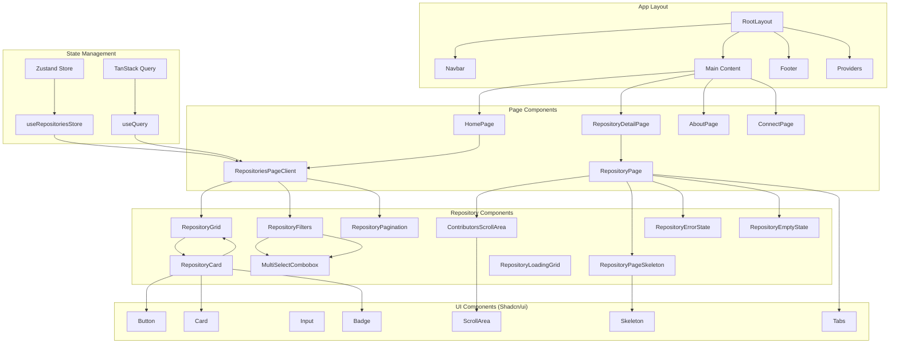

# Components Overview

The UC ORB Showcase frontend is built with a comprehensive component architecture using React 19, TypeScript, and modern design patterns. This guide provides an overview of all components, their relationships, and usage patterns.

## Component Architecture



## Component Categories

### 1. Layout Components
Components that provide the overall application structure and navigation.

### 2. Page Components
Top-level components that represent entire pages or major sections.

### 3. UI Components
Reusable interface components for displaying data and handling user interactions.

### 4. State Components
Components that manage complex state logic and data flow.

### 5. Utility Components
Helper components for loading states, error handling, and common patterns.

## Component Hierarchy

### Root Level
```
RootLayout (app/layout.tsx)
├── Providers (app/Providers.tsx)
│   └── QueryClientProvider
├── ThemeProvider
├── Navbar
├── {children} (Page Content)
└── Footer
```

### Repository Pages
```
RepositoriesPage (app/repositories/page.tsx)
└── RepositoriesPageClient
    ├── RepositoryFilters
    │   ├── SearchInput
    │   ├── UniversityFilter (MultiSelectCombobox)
    │   ├── LanguageFilter (MultiSelectCombobox)
    │   ├── LicenseFilter (MultiSelectCombobox)
    │   ├── OwnerFilter (MultiSelectCombobox)
    │   └── TopicFilter (MultiSelectCombobox)
    ├── RepositoryGrid
    │   └── RepositoryCard (multiple)
    └── RepositoryPagination

RepositoryDetailPage (app/repositories/[owner]/[repo]/page.tsx)
└── RepositoryPage
    ├── RepositoryMetadata
    ├── RepositoryReadme
    └── ContributorsScrollArea
```

## Component Props and Interfaces

### Repository Data Interface
```typescript
interface Repository {
  full_name: string;
  description?: string;
  language?: string;
  license?: string;
  owner?: string;
  university?: string;
  stargazers_count?: string;
  forks_count?: string;
  html_url?: string;
  topic_area_ai?: string;
  // ... other fields
}
```

### Common Component Patterns

#### Props Interface Pattern
```typescript
interface ComponentProps {
  // Required props
  data: Repository[];
  onAction: (item: Repository) => void;
  
  // Optional props with defaults
  loading?: boolean;
  error?: string | null;
  className?: string;
  
  // Event handlers
  onFilter?: (filters: FilterState) => void;
  onSort?: (field: string, order: 'asc' | 'desc') => void;
}
```

#### Children Pattern
```typescript
interface ContainerProps {
  children: React.ReactNode;
  title?: string;
  actions?: React.ReactNode;
}
```

## State Management Integration

### Zustand Store Connection
```typescript
// Component using Zustand store
export function RepositoryFilters() {
  const searchTerm = useRepositoriesStore((state) => state.searchTerm);
  const setSearchTerm = useRepositoriesStore((state) => state.setSearchTerm);
  
  const handleSearchChange = (value: string) => {
    setSearchTerm(value);
  };
  
  return (
    <input 
      value={searchTerm}
      onChange={(e) => handleSearchChange(e.target.value)}
    />
  );
}
```

### TanStack Query Integration
```typescript
// Component using TanStack Query
export function RepositoriesPageClient() {
  const { data: repositories, isLoading, error } = useQuery({
    queryKey: ['repositories'],
    queryFn: fetchRepositories,
  });
  
  if (isLoading) return <RepositoryLoadingGrid />;
  if (error) return <RepositoryErrorState error={error} />;
  
  return <RepositoryGrid repositories={repositories} />;
}
```

## Component Communication Patterns

### Props Down, Events Up
```typescript
// Parent component
function RepositoriesPageClient() {
  const [filters, setFilters] = useState<FilterState>({});
  
  const handleFilterChange = (newFilters: FilterState) => {
    setFilters(newFilters);
  };
  
  return (
    <div>
      <RepositoryFilters 
        filters={filters}
        onFilterChange={handleFilterChange}
      />
      <RepositoryGrid 
        repositories={filteredRepositories}
        loading={isLoading}
      />
    </div>
  );
}
```

### Context for Deep Props
```typescript
// Repository context for deep component trees
const RepositoryContext = createContext<Repository | null>(null);

function RepositoryPage({ repo }: { repo: Repository }) {
  return (
    <RepositoryContext.Provider value={repo}>
      <RepositoryHeader />
      <RepositoryContent />
      <RepositoryFooter />
    </RepositoryContext.Provider>
  );
}

function RepositoryHeader() {
  const repo = useContext(RepositoryContext);
  return <h1>{repo?.full_name}</h1>;
}
```

## Styling and Design System

### Tailwind CSS Classes
```typescript
// Consistent styling patterns
const cardStyles = "bg-white border shadow-xl hover:shadow-2xl transition-all duration-300";
const buttonStyles = "bg-sky-600 hover:bg-sky-700 text-white px-4 py-2 rounded-md";
const inputStyles = "border border-gray-300 rounded-md px-3 py-2 focus:ring-2 focus:ring-sky-500";
```

### Shadcn/ui Integration
```typescript
import { Button } from "@/components/ui/button";
import { Card, CardContent, CardHeader, CardTitle } from "@/components/ui/card";
import { Input } from "@/components/ui/input";

function ExampleComponent() {
  return (
    <Card>
      <CardHeader>
        <CardTitle>Repository Details</CardTitle>
      </CardHeader>
      <CardContent>
        <Input placeholder="Search repositories..." />
        <Button>Search</Button>
      </CardContent>
    </Card>
  );
}
```

## Performance Optimization Patterns

### Memoization
```typescript
// Memoized expensive computations
const filteredRepositories = useMemo(() => {
  return repositories.filter(repo => 
    repo.language === selectedLanguage &&
    repo.university === selectedUniversity
  );
}, [repositories, selectedLanguage, selectedUniversity]);

// Memoized components
const RepositoryCard = memo(({ repository }: { repository: Repository }) => {
  return (
    <div>
      <h3>{repository.full_name}</h3>
      <p>{repository.description}</p>
    </div>
  );
});
```

### Callback Optimization
```typescript
// Stable callback references
const handleRepositoryClick = useCallback((repository: Repository) => {
  router.push(`/repositories/${repository.full_name}`);
}, [router]);

const handleFilterChange = useCallback((newFilters: FilterState) => {
  setFilters(newFilters);
  setPage(1); // Reset pagination
}, []);
```

## Error Handling Patterns

### Error Boundaries
```typescript
class RepositoryErrorBoundary extends Component<
  { children: ReactNode },
  { hasError: boolean }
> {
  constructor(props: { children: ReactNode }) {
    super(props);
    this.state = { hasError: false };
  }
  
  static getDerivedStateFromError(error: Error) {
    return { hasError: true };
  }
  
  render() {
    if (this.state.hasError) {
      return <RepositoryErrorState error="Something went wrong" />;
    }
    
    return this.props.children;
  }
}
```

### Graceful Degradation
```typescript
function RepositoryCard({ repository }: { repository: Repository }) {
  return (
    <Card>
      <CardHeader>
        <CardTitle>{repository.full_name || 'Unknown Repository'}</CardTitle>
      </CardHeader>
      <CardContent>
        <p>{repository.description || 'No description available'}</p>
        {repository.language && (
          <Badge>{repository.language}</Badge>
        )}
        {repository.stargazers_count && (
          <span>⭐ {repository.stargazers_count}</span>
        )}
      </CardContent>
    </Card>
  );
}
```

## Loading State Patterns

### Skeleton Loading
```typescript
function RepositoryCardSkeleton() {
  return (
    <Card>
      <CardHeader>
        <Skeleton className="h-6 w-3/4" />
        <Skeleton className="h-4 w-1/2" />
      </CardHeader>
      <CardContent>
        <Skeleton className="h-4 w-full mb-2" />
        <Skeleton className="h-4 w-2/3" />
        <div className="flex gap-2 mt-4">
          <Skeleton className="h-6 w-16" />
          <Skeleton className="h-6 w-12" />
        </div>
      </CardContent>
    </Card>
  );
}
```

### Progressive Loading
```typescript
function RepositoryGrid({ repositories }: { repositories: Repository[] }) {
  const [loadedCount, setLoadedCount] = useState(10);
  
  const visibleRepositories = repositories.slice(0, loadedCount);
  
  const loadMore = () => {
    setLoadedCount(prev => Math.min(prev + 10, repositories.length));
  };
  
  return (
    <div>
      <div className="grid grid-cols-1 md:grid-cols-2 lg:grid-cols-3 gap-6">
        {visibleRepositories.map(repo => (
          <RepositoryCard key={repo.full_name} repository={repo} />
        ))}
      </div>
      {loadedCount < repositories.length && (
        <Button onClick={loadMore}>Load More</Button>
      )}
    </div>
  );
}
```

## Accessibility Patterns

### Keyboard Navigation
```typescript
function RepositoryCard({ repository }: { repository: Repository }) {
  const handleKeyDown = (event: KeyboardEvent) => {
    if (event.key === 'Enter' || event.key === ' ') {
      event.preventDefault();
      router.push(`/repositories/${repository.full_name}`);
    }
  };
  
  return (
    <div
      role="button"
      tabIndex={0}
      onKeyDown={handleKeyDown}
      onClick={() => router.push(`/repositories/${repository.full_name}`)}
      className="cursor-pointer focus:ring-2 focus:ring-sky-500"
    >
      {/* Card content */}
    </div>
  );
}
```

### Screen Reader Support
```typescript
function RepositoryStats({ repository }: { repository: Repository }) {
  return (
    <div className="flex gap-4">
      <span aria-label={`${repository.stargazers_count} stars`}>
        ⭐ {repository.stargazers_count}
      </span>
      <span aria-label={`${repository.forks_count} forks`}>
        🍴 {repository.forks_count}
      </span>
    </div>
  );
}
```

## Testing Patterns

### Component Testing
```typescript
import { render, screen, fireEvent } from '@testing-library/react';
import { RepositoryCard } from './RepositoryCard';

const mockRepository: Repository = {
  full_name: 'test/repo',
  description: 'Test repository',
  language: 'TypeScript',
  stargazers_count: '100',
};

test('renders repository card with correct information', () => {
  render(<RepositoryCard repository={mockRepository} />);
  
  expect(screen.getByText('test/repo')).toBeInTheDocument();
  expect(screen.getByText('Test repository')).toBeInTheDocument();
  expect(screen.getByText('TypeScript')).toBeInTheDocument();
  expect(screen.getByText('⭐ 100')).toBeInTheDocument();
});

test('navigates to repository page on click', () => {
  const mockPush = jest.fn();
  jest.mock('next/navigation', () => ({
    useRouter: () => ({ push: mockPush }),
  }));
  
  render(<RepositoryCard repository={mockRepository} />);
  
  fireEvent.click(screen.getByRole('button'));
  expect(mockPush).toHaveBeenCalledWith('/repositories/test/repo');
});
```

This component architecture provides a solid foundation for building scalable, maintainable, and performant React applications with proper separation of concerns and reusability.