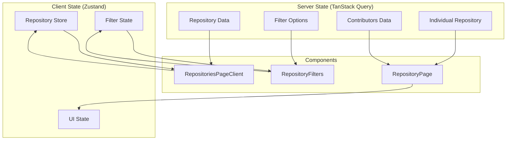

# State Management

UC ORB Showcase uses a modern state management approach combining Zustand for global state and TanStack Query for server state management. This section covers the complete state management architecture.

## State Architecture Overview



## Zustand Store

The application uses a single Zustand store for managing global client state, primarily focused on repository filtering and search functionality.

### Store Definition

```typescript
// store/repositories.ts
import { create } from 'zustand';

export interface Repository {
  full_name: string;
  description?: string;
  language?: string;
  license?: string;
  owner?: string;
  university?: string;
  stargazers_count?: string;
  forks_count?: string;
  subscribers_count?: string;
  created_at?: string;
  updated_at?: string;
  pushed_at?: string;
  readme?: string;
  default_branch?: string;
  topic_area_ai?: string;
  html_url?: string;
  homepage?: string;
  organization?: string;
  // Contact information
  contact_name?: string;
  contact_email?: string;
  contact_name2?: string;
  contact_email2?: string;
  contact_name3?: string;
  contact_email3?: string;
  // Funding information
  funder1?: string;
  grant_number1_1?: string;
  grant_number1_2?: string;
  grant_number1_3?: string;
  funder2?: string;
  grant_number2_1?: string;
  grant_number2_2?: string;
  grant_number2_3?: string;
}

interface RepositoriesState {
  // Repository data
  repositories: Repository[];
  setRepositories: (repositories: Repository[]) => void;
  
  // Search state
  searchTerm: string;
  setSearchTerm: (term: string) => void;
  
  // Filter states
  universitiesSelected: string[];
  setUniversitiesSelected: (universities: string[]) => void;
  
  languagesSelected: string[];
  setLanguagesSelected: (languages: string[]) => void;
  
  licensesSelected: string[];
  setLicensesSelected: (licenses: string[]) => void;
  
  ownersSelected: string[];
  setOwnersSelected: (owners: string[]) => void;
  
  topicsSelected: string[];
  setTopicsSelected: (topics: string[]) => void;
}

export const useRepositoriesStore = create<RepositoriesState>((set) => ({
  // Initial state
  repositories: [],
  searchTerm: "",
  universitiesSelected: [],
  languagesSelected: [],
  licensesSelected: [],
  ownersSelected: [],
  topicsSelected: [],
  
  // Actions
  setRepositories: (repositories) => set({ repositories }),
  setSearchTerm: (searchTerm) => set({ searchTerm }),
  setUniversitiesSelected: (universitiesSelected) => set({ universitiesSelected }),
  setLanguagesSelected: (languagesSelected) => set({ languagesSelected }),
  setLicensesSelected: (licensesSelected) => set({ licensesSelected }),
  setOwnersSelected: (ownersSelected) => set({ ownersSelected }),
  setTopicsSelected: (topicsSelected) => set({ topicsSelected }),
}));
```

### Store Usage Patterns

#### Selective Subscriptions
Components subscribe only to the state they need, preventing unnecessary re-renders:

```typescript
// Only subscribe to search term
const searchTerm = useRepositoriesStore((state) => state.searchTerm);
const setSearchTerm = useRepositoriesStore((state) => state.setSearchTerm);

// Only subscribe to university filters
const universitiesSelected = useRepositoriesStore((state) => state.universitiesSelected);
const setUniversitiesSelected = useRepositoriesStore((state) => state.setUniversitiesSelected);

// Subscribe to multiple related pieces of state
const { repositories, searchTerm, universitiesSelected } = useRepositoriesStore((state) => ({
  repositories: state.repositories,
  searchTerm: state.searchTerm,
  universitiesSelected: state.universitiesSelected,
}));
```

#### State Updates
State updates are performed through dedicated setter functions:

```typescript
function SearchInput() {
  const searchTerm = useRepositoriesStore((state) => state.searchTerm);
  const setSearchTerm = useRepositoriesStore((state) => state.setSearchTerm);
  
  const handleSearchChange = (event: React.ChangeEvent<HTMLInputElement>) => {
    setSearchTerm(event.target.value);
  };
  
  return (
    <Input
      value={searchTerm}
      onChange={handleSearchChange}
      placeholder="Search repositories..."
    />
  );
}
```

## TanStack Query Integration

TanStack Query manages all server state, providing caching, background updates, and error handling.

### Query Client Configuration

```typescript
// app/Providers.tsx
import { QueryClient, QueryClientProvider } from '@tanstack/react-query';

const queryClient = new QueryClient({
  defaultOptions: {
    queries: {
      staleTime: 300_000,  // 5 minutes
      gcTime: 600_000,     // 10 minutes (formerly cacheTime)
      refetchOnWindowFocus: false,
      retry: (failureCount, error) => {
        // Don't retry on 404s
        if (error instanceof Error && error.message.includes('404')) {
          return false;
        }
        return failureCount < 3;
      },
    },
  },
});

export function Providers({ children }: { children: React.ReactNode }) {
  return (
    <QueryClientProvider client={queryClient}>
      {children}
    </QueryClientProvider>
  );
}
```

### Repository Data Queries

#### Fetch All Repositories
```typescript
// In RepositoriesPageClient component
const { data: repositories, isLoading, error } = useQuery({
  queryKey: ['repositories'],
  queryFn: async () => {
    const response = await fetch(`${API_URL}/repositories`);
    if (!response.ok) {
      throw new Error('Failed to fetch repositories');
    }
    return response.json();
  },
  staleTime: 300_000, // 5 minutes
});

// Update Zustand store when data is fetched
useEffect(() => {
  if (repositories && repositories.length > 0) {
    setRepositories(repositories);
  }
}, [repositories, setRepositories]);
```

#### Fetch Individual Repository
```typescript
// In RepositoryDetailPage component
const { data: repository, isLoading, error, isFetched } = useQuery<Repository>({
  queryKey: ['repository', owner, repo],
  queryFn: async () => {
    const response = await fetch(`${API_URL}/repositories/${owner}/${repo}`);
    if (response.status === 404) {
      const errorData = await response.json().catch(() => ({}));
      const message = errorData.detail || 'Repository not found';
      const error = new Error(message);
      (error as any).code = 404;
      throw error;
    }
    if (!response.ok) {
      throw new Error('Failed to fetch repository');
    }
    return response.json();
  },
  enabled: !!owner && !!repo,
  retry: false,
  staleTime: 300_000,
});
```

#### Fetch Filter Options
```typescript
// Filter option queries
const { data: universities = [] } = useQuery({
  queryKey: ['universities'],
  queryFn: () => fetch(`${API_URL}/universities`).then(res => res.json()),
  staleTime: 600_000, // 10 minutes - filter options change rarely
});

const { data: languages = [] } = useQuery({
  queryKey: ['languages'],
  queryFn: () => fetch(`${API_URL}/languages`).then(res => res.json()),
  staleTime: 600_000,
});

const { data: licenses = [] } = useQuery({
  queryKey: ['licenses'],
  queryFn: () => fetch(`${API_URL}/licenses`).then(res => res.json()),
  staleTime: 600_000,
});

const { data: organizations = [] } = useQuery({
  queryKey: ['organizations'],
  queryFn: () => fetch(`${API_URL}/organizations`).then(res => res.json()),
  staleTime: 600_000,
});

const { data: topics = [] } = useQuery({
  queryKey: ['topics'],
  queryFn: () => fetch(`${API_URL}/topics`).then(res => res.json()),
  staleTime: 600_000,
});
```

#### Fetch Contributors
```typescript
// In RepositoryDetailPage component
const { data: contributors = [], isLoading: isContributorsLoading } = useQuery<any[]>({
  queryKey: ['repository-contributors', repository?.full_name],
  queryFn: async () => {
    if (repository && repository.full_name && repository.full_name.includes("/")) {
      const [repoOwner, repoName] = repository.full_name.split("/");
      const response = await fetch(`https://api.github.com/repos/${repoOwner}/${repoName}/contributors`);
      if (!response.ok) {
        throw new Error('Failed to fetch contributors from GitHub');
      }
      return response.json();
    } else {
      throw new Error('Repository full_name not available');
    }
  },
  enabled: !!repository && !!repository.full_name && repository.full_name.includes("/"),
  staleTime: 300_000,
});
```

## Client-Side Filtering

The application implements efficient client-side filtering for instant user feedback, combining Zustand state with computed values.

### Filtering Logic

```typescript
// In RepositoriesPageClient component
const filteredRepositories = React.useMemo(() => {
  if (!repositories) return [];
  
  let result = repositories;
  
  // Apply category filters
  if (universitiesSelected.length > 0) {
    result = result.filter(r => r.university && universitiesSelected.includes(r.university));
  }
  
  if (languagesSelected.length > 0) {
    result = result.filter(r => r.language && languagesSelected.includes(r.language));
  }
  
  if (licensesSelected.length > 0) {
    result = result.filter(r => r.license && licensesSelected.includes(r.license));
  }
  
  if (ownersSelected.length > 0) {
    result = result.filter(r => r.owner && ownersSelected.includes(r.owner));
  }
  
  if (topicsSelected.length > 0) {
    result = result.filter(r => r.topic_area_ai && topicsSelected.includes(r.topic_area_ai));
  }
  
  // Apply fuzzy search
  if (searchTerm.trim()) {
    const fuzzy = fuzzysort.go(
      searchTerm,
      result,
      { 
        keys: ["full_name", "description"], 
        threshold: -10000, 
        limit: 50 
      }
    );
    result = fuzzy.map(r => r.obj);
  }
  
  return result;
}, [repositories, universitiesSelected, languagesSelected, licensesSelected, ownersSelected, topicsSelected, searchTerm]);
```

### Pagination State

```typescript
// Pagination is managed with local component state
const [page, setPage] = React.useState(1);
const [pageSize, setPageSize] = React.useState(20);

// Reset page when filters change
React.useEffect(() => {
  setPage(1);
}, [searchTerm, universitiesSelected, languagesSelected, licensesSelected, ownersSelected]);

// Calculate pagination values
const totalItems = filteredRepositories.length;
const totalPages = Math.max(1, Math.ceil(totalItems / pageSize));

// Get current page of results
const pagedRepositories = React.useMemo(() =>
  filteredRepositories.slice((page - 1) * pageSize, page * pageSize),
  [filteredRepositories, page, pageSize]
);
```

## URL State Synchronization

The application synchronizes certain state with URL parameters for bookmarkable searches.

### Search Parameter Sync

```typescript
// In RepositoriesPageClient component
import { useSearchParams } from 'next/navigation';

const searchParams = useSearchParams();
const setSearchTerm = useRepositoriesStore((state) => state.setSearchTerm);

// Sync URL search param to store on mount
useEffect(() => {
  const urlSearch = searchParams.get("search");
  if (urlSearch) {
    setSearchTerm(urlSearch);
  }
}, [searchParams, setSearchTerm]);
```

## Error Handling

### Query Error Handling

```typescript
// Repository list error handling
const { data: repositories, isLoading, error } = useQuery({
  queryKey: ['repositories'],
  queryFn: fetchRepositories,
  retry: (failureCount, error) => {
    // Don't retry on client errors
    if (error instanceof Error && error.message.includes('4')) {
      return false;
    }
    return failureCount < 3;
  },
});

// Error state rendering
if (error) {
  return <RepositoryErrorState error={error} onRetry={() => refetch()} />;
}
```

### Repository Detail Error Handling

```typescript
// Special handling for 404 errors
const is404 = (
  shouldFetch &&
  isError &&
  error &&
  ((typeof error === "object" && error !== null && "code" in error && (error as any).code === 404) ||
    error.message === "Repository not found")
);

if (is404 && isFetched) {
  return (
    <RepositoryErrorState error="Repository not found">
      <div className="flex flex-col items-center gap-2 mt-4">
        <Link href="/repositories" className="text-sky-700 underline">
          Back to Repositories
        </Link>
      </div>
    </RepositoryErrorState>
  );
}
```

## Performance Optimizations

### Memoization

```typescript
// Memoize expensive filtering operations
const filteredRepositories = React.useMemo(() => {
  // Expensive filtering logic
}, [repositories, ...filterDependencies]);

// Memoize paginated results
const pagedRepositories = React.useMemo(() =>
  filteredRepositories.slice((page - 1) * pageSize, page * pageSize),
  [filteredRepositories, page, pageSize]
);
```

### Selective Re-renders

```typescript
// Use selective subscriptions to prevent unnecessary re-renders
const searchTerm = useRepositoriesStore((state) => state.searchTerm);
// Component only re-renders when searchTerm changes

// Avoid subscribing to entire store
const { repositories, searchTerm } = useRepositoriesStore(); // ❌ Re-renders on any state change

// Instead, use selective subscriptions
const repositories = useRepositoriesStore((state) => state.repositories); // ✅ Only re-renders when repositories change
const searchTerm = useRepositoriesStore((state) => state.searchTerm); // ✅ Only re-renders when searchTerm changes
```

### Query Optimization

```typescript
// Optimize query keys for proper caching
const { data: repository } = useQuery({
  queryKey: ['repository', owner, repo], // ✅ Specific cache key
  queryFn: () => fetchRepository(owner, repo),
});

// Avoid dynamic query keys that prevent caching
const { data: repository } = useQuery({
  queryKey: ['repository', Math.random()], // ❌ Never cached
  queryFn: () => fetchRepository(owner, repo),
});
```

## State Management Best Practices

### 1. Separation of Concerns
- **Zustand**: Client state (filters, UI state, temporary data)
- **TanStack Query**: Server state (API data, caching, background updates)
- **Local State**: Component-specific state (form inputs, local UI state)

### 2. Selective Subscriptions
```typescript
// ✅ Good - Only subscribe to needed state
const searchTerm = useRepositoriesStore((state) => state.searchTerm);

// ❌ Bad - Subscribe to entire store
const store = useRepositoriesStore();
```

### 3. Proper Cache Keys
```typescript
// ✅ Good - Specific, stable cache keys
queryKey: ['repositories']
queryKey: ['repository', owner, repo]
queryKey: ['contributors', fullName]

// ❌ Bad - Generic or unstable cache keys
queryKey: ['data']
queryKey: ['repository', Math.random()]
```

### 4. Error Boundaries
```typescript
// Wrap components in error boundaries for graceful error handling
<ErrorBoundary fallback={<RepositoryErrorState />}>
  <RepositoriesPageClient />
</ErrorBoundary>
```

### 5. Loading States
```typescript
// Provide appropriate loading states for better UX
if (isLoading) return <RepositoryLoadingGrid />;
if (error) return <RepositoryErrorState error={error} />;
return <RepositoryGrid repositories={repositories} />;
```

This state management architecture provides a robust, performant, and maintainable foundation for the UC ORB Showcase application, ensuring smooth user interactions and efficient data handling.