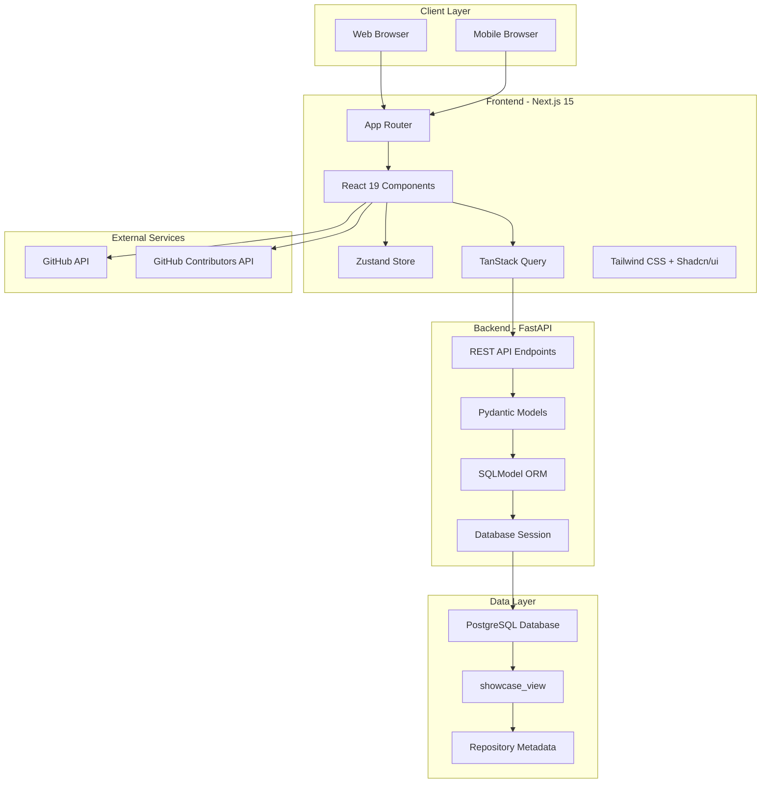

# UC ORB Showcase Documentation

Welcome to the comprehensive documentation for **UC ORB Showcase** - the University of California Open Repository Browser. This platform showcases world-class open source scientific software from across the UC system.

## What is UC ORB Showcase?

UC ORB Showcase is a full-stack web application designed to discover, explore, and showcase open source repositories from the University of California system. It provides researchers, students, and collaborators with a modern, intuitive interface to browse UC's rich ecosystem of scientific software.

## Key Features

🔍 **Advanced Search & Filtering**
- Fuzzy search across repository names and descriptions
- Filter by UC campus, programming language, license, and topics
- Real-time results with intelligent ranking

🏛️ **UC System Integration**
- Comprehensive coverage of all UC campuses
- Academic context with funding and grant information
- Research area classification and topic discovery

⚡ **Modern Architecture**
- Next.js 15 frontend with React 19
- FastAPI backend with PostgreSQL database
- Type-safe development with TypeScript
- Responsive design for all devices

🚀 **Performance Optimized**
- Client-side filtering for instant results
- Intelligent caching with TanStack Query
- Optimized database queries and indexing

## Architecture Overview

## Quick Navigation

### 📚 **For Developers**
- [Architecture Overview](./architecture) - System design and technical decisions
- [Getting Started](./getting-started) - Setup and development environment
- [API Reference](./api/overview) - Complete API documentation
- [Components Guide](./components/overview) - Frontend component architecture

### 🏗️ **Project Structure**
- [Project Overview](./project-structure/overview) - Complete project organization
- [Architecture Overview](./architecture) - System design and technical decisions

### 🛠️ **Development**
- [Development Setup](./development/setup) - Local development environment
- [Getting Started](./getting-started) - Setup and development guide

### 🤝 **Contributing**
- [Contributing Guide](./contributing) - How to contribute to the project
- [Troubleshooting](./troubleshooting) - Common issues and solutions

## Technology Stack

### Frontend
- **Framework**: Next.js 15 with App Router
- **UI Library**: React 19 with TypeScript
- **Styling**: Tailwind CSS + Radix UI components
- **State Management**: Zustand for global state
- **Data Fetching**: TanStack Query for server state
- **Forms**: React Hook Form with Zod validation

### Backend
- **Framework**: FastAPI (Python)
- **Database**: PostgreSQL with SQLModel ORM
- **Validation**: Pydantic models
- **API Documentation**: Auto-generated OpenAPI/Swagger

### Infrastructure
- **Frontend Deployment**: Vercel
- **Backend Deployment**: Docker containers
- **Database**: PostgreSQL (cloud or self-hosted)
- **Documentation**: Docusaurus (this site!)

## Getting Started

1. **Explore the Live Application**
   - Visit the [UC ORB Showcase](https://uc-orb-showcase.vercel.app)
   - Browse repositories and try the search functionality

2. **Set Up Development Environment**
   - Follow the [Development Setup](./development/setup) guide
   - Clone the repository and install dependencies

3. **Understand the Architecture**
   - Read the [Architecture Overview](./architecture)
   - Explore the [Project Structure](./project-structure/overview)

4. **Start Contributing**
   - Check the [Contributing Guide](./contributing)
   - Look at open issues on GitHub

## Documentation Structure

This documentation is organized into three main sections:

### 📖 **Main Documentation**
Comprehensive guides covering architecture, setup, and development workflows.

### 🔌 **API Reference**
Complete API documentation with endpoints, models, and examples.

### 🧩 **Components Guide**
Detailed component documentation covering pages, UI components, and state management.

## Support and Community

- **GitHub Repository**: [UC-OSPO-Network/orb-showcase](https://github.com/UC-OSPO-Network/orb-showcase)
- **Issues & Bugs**: [GitHub Issues](https://github.com/UC-OSPO-Network/orb-showcase/issues)
- **UC OSPO Network**: [ucospo.org](https://ucospo.org)

---

*This documentation is maintained by the UC OSPO Network and the open source community. Contributions are welcome!*